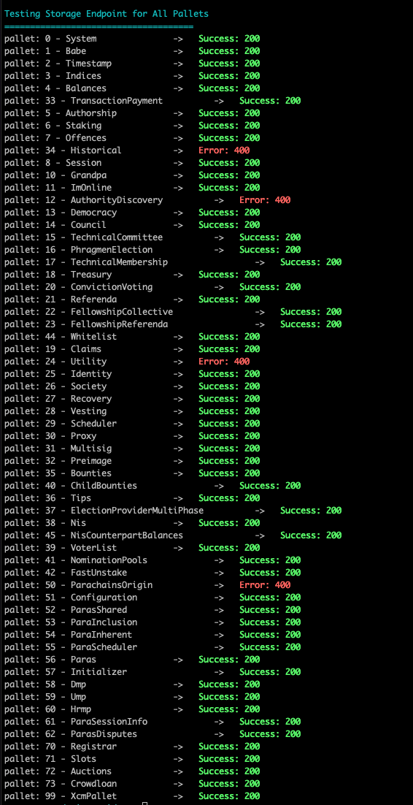

## Testing Sidecar's Endpoints
Script that queries Sidecar's endpoints first to retrieve the indexes of the pallets of a chain and
then queries
- `/pallets/:palletId/storage/` endpoint from `master` branch
- `/pallets/:palletId/errors/` from a development branch (not yet merged to master)

### Prerequisites
- Have a [Sidecar](https://github.com/paritytech/substrate-api-sidecar) instance running connected to a local or live chain (e.g. Kusama)
- git clone this repo
- cd to cloned repo
- Have `nodejs` installed
- Install axios: `install i axios`

### How to run
- If the instance of Sidecar you are running is from `master` branch, you should comment lines 38-43.
- `node main.js`

### Example Result
- When you have a Sidecar instance connected to Kusama / Polkadot 

