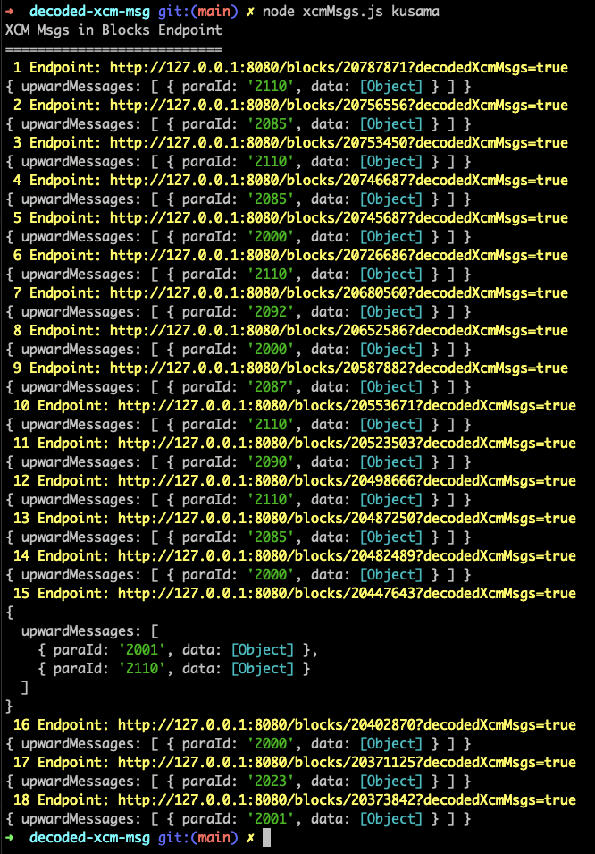

## Testing Sidecar's Blocks Endpoints
Script that queries Sidecar's `blocks` endpoints and retrieves the decoded XCM messages found.

### Prerequisites
- Have `nodejs` installed.
- Install axios: `npm install axios`.
- Have a sidecar instance running locally (in a separate terminal).
  - The sidecar instance should be connected to the chain we would like to retrieve the XCM messages from.
  - You can find the corresponding `.env` file needed for your sidecar instance in the folder `./env-files` in the current directory.

### How to run
- Clone the repo, `testing-sidecar`
- Go into the corresponding folder : `cd decoded-xcm-msg`
- Run the script with the command  `node xcmMsgs.js {CHAIN}`
- Replace `{CHAIN}` with one of the following (shown in alphabetic order) :
    - `acala`: for Acala Parachain
    - `astar`: for Astar Parachain
    - `basilisk`: for Basilisk Parachain
    - `bifrost`: for Bifrost Parachain
    - `kusama-asset-hub`: for Kusama Asset Hub chain
    - `kusama`: for Kusama Relay chain
    - `manta`: for Manta Parachain
    - `moonbeam`: for Moonbeam Parachain
    - `polkadot-asset-hub`: for Polkadot Asset Hub chain
    - `polkadot`: for Polkadot Relay chain
    - `robonomics`: for Robonomics Parachain
    - `westend-asset-hub`: for Westend Asset Hub
- Optional flag `transit` to run for blocks with `in transit` messages, e.g.:
    - `node xcmMsgs.js kusama transit` or `node xcmMsgs.js polkadot transit`

  depending on the chain you would like to test each time.

### Example on How to Use & Test
- Open one terminal and run sidecar connected to `kusama` (using .env file `/env-files/.env.kusama`) with the command 
  ```
  NODE_ENV=kusama yarn start
  ```
- Open a second terminal and go into this repository and follow the steps on the `How to run` section.
  - The command to run in the 2nd terminal should be for kusama so:
    ```
    node xcmMsgs.js kusama
    ```
  - The output should be :

    


### Notes
- Check in `/blocks-with-xcm-msgs/` to find a file with test blocks for each chain.
- Check in `/blocks-with-xcm-msgs/_NOTES.md` to see what type of messages are expected in each test block.
- In `xcmMsgs.js` file you can find the code you run with the above command.