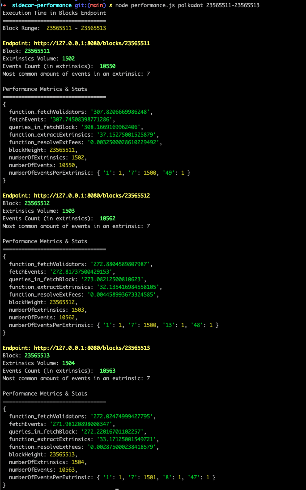

## Testing Sidecar's Blocks Endpoints
Script that queries Sidecar's `blocks` endpoints and retrieves performance metrics.

### Prerequisites
- Have `nodejs` installed.
- Install axios: `npm install axios`.
- Have a sidecar instance cloned from the repo [substrate-api-sidecar-with-measuring](https://github.com/Imod7/substrate-api-sidecar-with-measuring) running locally (in a separate terminal).
  - Right now you need to checkout in the branch `domi-add-execution-times` : `git checkout domi-add-execution-times`
  - The sidecar instance should be connected to the chain we would like to retrieve the metrics from.
  - You can find the corresponding `.env` file needed for your sidecar instance in the folder `./env-files` in the current directory.

### How to run
- Clone the repo, `testing-sidecar`
- Go into the corresponding folder : `cd sidecar-performance`
- Run the script with the command  `node performance.js {CHAIN} {STARTBLOCK-ENDBLOCK}`
- Replace `{CHAIN}` with the name of the chain, e.g. :
    - `polkadot`: for Polkadot Relay chain
- Replace `{STARTBLOCK-ENDBLOCK}` with a block range. Examples :
    - `23528139-23528171`: a block range in the Polkadot network with a very high volume of extrinsics
    - `23528401-23528418`: Polkadot
    - `23565511-23565694`: Polkadot

### Example on How to Use & Test
- Open one terminal and run sidecar connected to `polkadot` (using .env file `/env-files/.env.polkadot`) with the command 
  ```
  NODE_ENV=polkadot yarn start
  ```
- Open a second terminal and go into this repository and follow the steps on the `How to run` section.
  - The command to run in the 2nd terminal should be for kusama so:
    ```
    node performance.js polkadot 23528139-23528171
    ```
  - The output should be :

    


### Notes
- The results are also saved in `output.txt`. Each line in the file represents the metrics for a specific block.